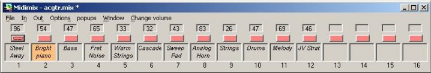
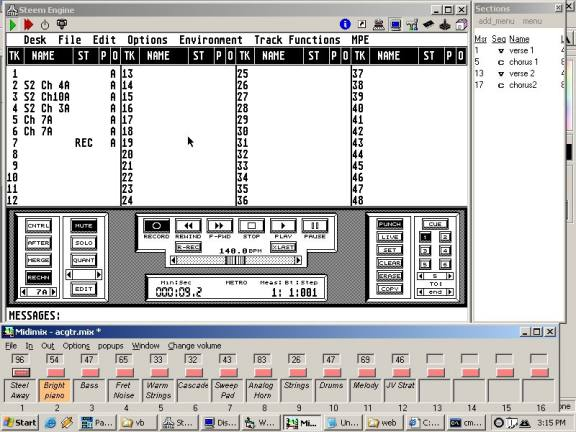
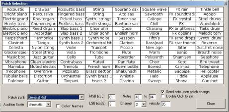

<table width="90%" border="0">
<tbody>

<tr>

<td>

# Midimix

Midimix is an application that adds extra functionality when I am arranging music using my music sequencing software (Dr. T's KCS Omega) running in a Steem v1.62 Atari ST Emulation window on a PC running Microsoft Windows.

Before deciding to take on the task of writing this application, I scoured the internet to find a comparable utility that I could use instead, but did not find anything suitable. So while putting in the effort of making this useful to me, I realized there probably is an unfulfilled need for this type of application by other musicians who sequence music on their PC, so I spent some time cleaning up the application so that it can be downloaded and used by other computer musicians as well.

Ultimately midimix can be used in conjunction with any other sequencing program that does not provide the functionality that midimix does. In addition there are many extra features that enable midimix to be used as a stand alone application.

This is what midimix looks like while running it in conjunction with Dr. T's Omega running inside the [Steem Atari ST Emulator](http://steem.atari.org). <small>_Click image for full size_</small>

* * *

## Download...

click [here](midimix.zip) to download the full installation program (recommended). sorry its such a big download!  
OR... download the [executable](midimix.exe), and config files [midimix.ini](midimix.ini) and [mmdata.ini](mmdata.ini)

* * *

## Documentation...

### patch selection tool page (click image to view full size)

 midimix can be used to organize and audition, keyboard patches. Patches are organized in banks of 128, which can be auditioned by clicking on the patch grid with the mouse. Banks can be assigned as a **standard** bank of 128 patches using a MSB (controller #0) value, LSB (controller #32) value, and incremental PG (program change) number, or as a **favorites** bank where each of the displayed 128 patches has a unique MSB, LSB, and PG value.

### MIDI mixing (controller editing) tool

Midimix can be used to mix a song by using the mouse to adjust any available continuous controller setting supported by the midi instrument (such as volume, pan, reverb, chorus etc)

### Song section scratchpad

Midimix can be used to chart out a song by displaying sections such as verse, chorus, bridge, turnaround, etc. By clicking on a song section midimix is able to jump to the appropriate measure in the song loaded in the sequencer application.

### Midi to keyboard mapper

Midimix can be programmed to send a keyboard command to the active application in response to reception of any midi event. Practical uses include pushing a button on your keyboard (or depressing the keyboard's hold pedal) to start recording on the sequencer, suspend (pause) the sequencer, or abort the current take.

### Load/Save Ability

Song settings consisting of patch selection info (Program Change events), and mix settings (all controller settings such as volume, pan, reverb, chorus, etc) can be saved into a songsettings (.mix) file, so after tweaking the settings, they can be saved and later reloaded and sent to the midi sound modules.

### configurable control panels

Midimix is configurable, allowing the user to configure only the desired controls to be visible. The available controls are:

#### patch name display box

This is the box that visually displays the name of the patch for the currently selected midi channel. The user can click in this box to set the current midi transmitting channel, and audition the currently selected patch by clicking the mouse inside the box, and can jump to the patch selection page to audition and change the selected patch.

#### parameter edit box

This is a compact substitute for a knob. Rather than using a graphic knob to modify a parameter (such as volume/pan), a small box that displays a number is much more compact and readily displays the controllers's value, which varies between 0-127\. And rather than display a bunch of knobs, a right click on the box selects the controller that it will control. So for example, you can click on the box and move the mouse to change the volume level, then right click to select pan, and click and move the mouse to change the pan. Any midi controller can be assigned, and the configuration file stores the controller types and names. (e.g. configure it to allow the user to click on "volume" and have it adjust controller #7)

#### solo/mute

Clicking on it will mute/unmute that midi channel. Right click for a menu to solo the channel.

#### level meter

A polyphony meter indicating midi activity per channel.

#### Animated channel activity indicators

An animated shape dances in response to note activity on that channel.

### keyboard display

This displays a picture of a piano keyboard, allowing user to click on any key to sound a note, and when a sequence is playing the user can see which keys are being played. Midi channels are able to be associated with user configurable colors. Looks very cool when watching an intricate performance displayed visually, like a virtual player piano.

#### midi file player

Play standard midi files through this included sequence player.

#### midi monitor

Displays each recieved midi message as they are recieved at the input port. When the patch audition window appears, the program change sent for a

### Configurable

Common settings are automatically saved when ending each session, and the more extensive customization settings are configured by directly [editing the configuration file](mm.htm#ini).

* * *

## Technical notes

The initialization file must be manually edited to add many of the user customizable features. An example Ini file is included which inclues example fields which can be modified.

[patchbanks] section

here is where you need to enter the information for the banks of sounds on your synthesizer modules.

* * *

A standard bank is numbered sequentially, from 0 to 127, using the same MSB (cc #0) and LSB (cc #32)  
the format is _bank=bankname, filename, MSB value, LSB value_  
where MSB value and LSB value are the values of controller #0 and #32 respectively, which will be sent to the sound module in addition to the program change (PG) to select the sound bank.

> **bank=General Midi,gm.dat,81,3**

Each line in the bank file that is referenced (e.g. gm.dat) must have the _patch name_ associated with the corresponding PG that corresponds to the line number in the file.

* * *

A **favorites** bank stores up to 128 patches with individually assigned PG, MSB, and LSB for each patch.

the format is _bank=bankname, filename_

> **favorites=favorite.dat,Favorites 1**

<table border="" cellspacing="0" cellpadding="9" width="65%" bordercolor="black">

<tbody>

<tr>

<td>The format of each line in the bank file that is referenced (e.b. favorites.dat) is:

> MSB,LSB,PG, patchname

for example

> 80,0,20,Slow Strings 80,0,1,My Piano

</td>

</tr>

</tbody>

</table>

* * *

### the [maps] section

remap key: used to translate a midi event into a keystroke

> format remap=statusbyte, databyte #1, databyte #2, incoming keycode, outgoing keypress
> 
> > For example: if you want to use your sustain pedal as a "punch in pedal" when recording, you may want the pedal to cause the "R" keystroke to start recording when it is depressed... so the following would accomplish that:
> > 
> > > remap=B0,40,7F,,'R' remap=B0,40,0,,''
> > 
> > The first line sets a trigger that will simulate pressing the letter 'R' when recieving a midi event of B0,40,7F (status byte, 1st data byte, 2nd data byte) where  
> > B0 = controller change  
> > 40 = controller value in hex (40 is hex for #64, which is the sustain pedal  
> > 7F = the data value of that controller (7F is hex for 127, which is the value sent when a pedal is depressed) The second line sets up a trigger that sends nothing (since the last value has nothing between the quotes) when the same type of midi message is recieved with a 0 value (when a sustain pedal is released, the 2nd data byte, which is the value of the controller, is 0)
> > 
> > the incoming keycode argument is optional, representing if you want redirect a keystroke to the sequencer
> > 
> > ### more settings in the [maps] section
> > 
> > (a bit obscure, may not be of interest...) app = the application that keystrokes will go to when passed through (if no app is defined, then keystrokes won't be passed through.
> > 
> > > app=Steem Engine
> > 
> > switch key is the keystroke that will pass control to the "app"
> > 
> > > switch_key=20
> > 
> > goto_key is the keystroke used to tell the sequencer to go to a particular measure
> > 
> > > goto_key=^g
> > 
> > followup_key is the keystroke sent after going to the measure, for example to start playback
> > 
> > > followup_key=
> > 
> > doubleclick_time is the amount of ms the program waits before sending a note from the patch selection window
> > 
> > > doubleclick_time=500
> > 
> > ## [controllers] section
> > 
> > Each controller needs to be included here in the format **_cc=number,name_**, for example,
> > 
> > > cc=7,volume
> > 
> > These controllers will appear in the controllers menu by name (also when right-clicking the parameter box). Any controllers appearing after the [invisible] header will NOT appear in the menu, although they will still store, send and recieve controller settings.
> > 
> > 

</a></td>

</tr>

</tbody>

</table>